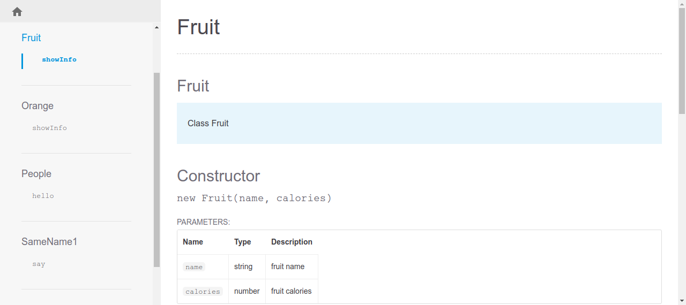

# JSDoc Generate
This [repository](https://github.com/jardelgoncalves/jsdoc-generate) presents a way to generate the javascript code documentation on a static website.

<div align="center">
  
</div>

## prerequisites
To generate good documentation, read the [JSDoc documentation](https://jsdoc.app/index.html). It is necessary to have **Node.js** and **NPM** installed.

## Running
First build the project by executing the command:
```
npm run build
```
Then open the `docs` directory and run the` index.html` file

